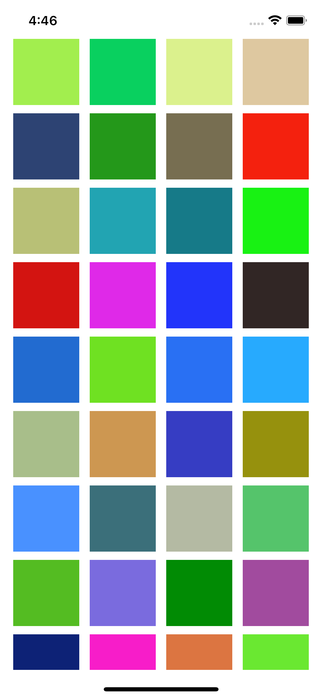

# PhotoApp(JEJE, yj)
## Major Implementation

### 1. (Collection View Layout) 콜렉션 뷰 생성 및 셀 배치 2021.03.22 17:40
- [x] 스토리보드 ViewController에 CollectionView를 추가하고 Safe 영역에 가득 채우도록 frame을 설정한다.
- [x] CollectionView Cell 크기를 80 x 80 로 지정한다.
- [x] UICollectionViewDataSource 프로토콜을 채택하고 40개 cell을 랜덤한 색상으로 채우도록 구현한다.
#### Display
 

#### Study keywords
- UICollectionView

### 2. (Collection View Layout) 콜렉션 뷰 생성 및 셀 배치 2021.03.23 19:00
- [x] UINavigationController 넣기
- [x] CollectionView Cell 크기를 100 x 100으로 지정
- [x] CollectionView Cell에 이미지뷰 추가
- [x] Photos 프레임워크로 휴대폰 앨범의 이미지를 앱에서 표시

해당 메소드 안에서 휴대폰 안에 있는 미디어를 불러옵니다. 원래는 섹션의 수를 정하는 UICollectionViewDataSource 프로토콜에서 섹션의 수를 정하는 메소드인데 임시로 .fetchAssets를 넣었습니다. 해당 메소드 좀 더 적절한 위치가 있는지 아직 고민입니다.
```
func collectionView(_ collectionView: UICollectionView, numberOfItemsInSection section: Int) -> Int {
        allPhotos = PHAsset.fetchAssets(with: nil)
        return allPhotos.count
    }
```
밑에 코드는 UICollectionViewCell을 xib파일로 구현해서 필요한 이니셜라이저인데 `self.register~`는 해당 collectionView에 xib파일로 만든 셀을 등록하는 거고 `PHPhotoLibrary.shared().register(self)`는 collectionView에 옵저버를 등록하는 메소드입니다.
```
required init?(coder: NSCoder) {
        super.init(coder: coder)
        self.dataSource = collectionViewDataSource
        self.delegate = collectionViewDataSource
        self.register(UINib(nibName: "PhotoCell", bundle: nil), forCellWithReuseIdentifier: "PhotoCell")
        PHPhotoLibrary.shared().register(self)
    }
```
```
extension PhotosCollectionView: PHPhotoLibraryChangeObserver {
    func photoLibraryDidChange(_ changeInstance: PHChange) {
        var assetCollection = self.collectionViewDataSource.allPhotos
        
        DispatchQueue.main.sync {
                    guard let changes = changeInstance.changeDetails(for: assetCollection!) else { return }
                    assetCollection = changes.fetchResultAfterChanges

                    if changes.hasIncrementalChanges {
                        self.performBatchUpdates({
                            if let removed = changes.removedIndexes , removed.count > 0 {
                                self.deleteItems(at: removed.map { IndexPath(item: $0, section:0) })
                            }
                            if let inserted = changes.insertedIndexes , inserted.count > 0 {
                                self.insertItems(at: inserted.map { IndexPath(item: $0, section:0) })
                            }
                            if let changed = changes.changedIndexes , changed.count > 0 {
                                self.reloadItems(at: changed.map { IndexPath(item: $0, section:0) })
                            }
                            changes.enumerateMoves { fromIndex, toIndex in
                                self.moveItem(at: IndexPath(item: fromIndex, section: 0),
                                                             to: IndexPath(item: toIndex, section: 0))
                            }
                        })
                    } else {
                        self.reloadData()
                    }
                }
    }
}
```
위 코드에서 볼 수 있듯이 `PHPhotoLibraryChangeObserver` 프로토콜을 사용하였고 밑에 `func photoLibraryDidChange`는 해당 프로토콜 필요 함수이며 코드 출처는 [애플공식문서](https://developer.apple.com/documentation/photokit/phphotolibrarychangeobserver) 입니다.

#### Study keywords
- UICollectionView
- Photos Frameworks

### 3. (GCD_Scheduling) 콜렉션 2021.03.25 17:00
- [x] Bundle에서 doodle.json 파일을 읽어와서 스위프트 데이터 구조로 변환
- [x] GCD 큐를 활용해서 동시에 최대한 효율적으로 여러 이미지를 다운로드 받아서 컬렉션 뷰에 표시
- [x] Navigation Bar Item 숨김 및 표시
- [x] 컬렉션 뷰의 셀을 길게 클릭하면 UIMenuItem이 표시되도록 구현
- [x] UIMenuItem의 Save 버튼을 클릭하면 해당 이미지가 포토라이브러리에 저장되도록 구현

#### Display


#### Study keywords
- Bundle
- Grand Central Dispatch
- Thread
- Navigation Bar
- JSON
- UILongPressGestureRecognizer
- UIMenuItem
